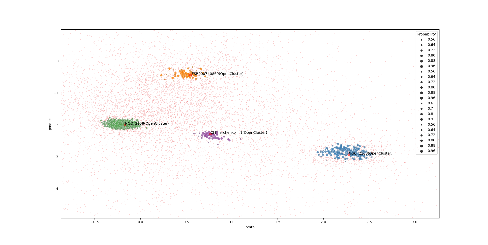

Quickstart
==========

Main functionality example
^^^^^^^^^^^^^^^^^^^^^^^^^^

.. literalinclude:: ../../examples/pipeline/dep.py
    :language: python
    :linenos:

Documentation quick guide
^^^^^^^^^^^^^^^^^^^^^^^^^

* Building queries for GAIA and retrieving data: :class:`~scludam.fetcher.Query`

* Detection and membership estimation pipeline: :class:`~scludam.pipeline.DEP`

* Detection method: :class:`~scludam.detection.CountPeakDetector`

* Clusterability tests: :py:mod:`~scludam.stat_tests`

* Clustering method: :class:`~scludam.shdbscan.SHDBSCAN`

* Probability Estimation: :class:`~scludam.membership.DBME`

* Kernel Density Estimation with per observation bandwidth and plugin method: :class:`~scludam.hkde.HKDE`

Documentation module guide
^^^^^^^^^^^^^^^^^^^^^^^^^^

* Query building, SIMBAD object searching and data related functionality: :py:mod:`~scludam.fetcher`

* Detection and membership estimation pipeline: :py:mod:`~scludam.pipeline`

* Detection: :py:mod:`~scludam.detection.CountPeakDetector`

* Clusterability tests: :py:mod:`~scludam.stat_tests`

* Clustering: :py:mod:`~scludam.shdbscan`

* Probability estimation: :py:mod:`~scludam.membership`

* Kernel Density Estimation:  :py:mod:`~scludam.hkde`

* Utils such as GAIA column names interpretation and one hot encoding:  :py:mod:`~scludam.utils`

* Custom ploting functions: :py:mod:`~scludam.plots`

* Utils for R communication:  :py:mod:`~scludam.rutils`

* Utils for masking data: :py:mod:`~scludam.masker`

* Useful distributions for data generation: :py:mod:`~scludam.synthetic`
