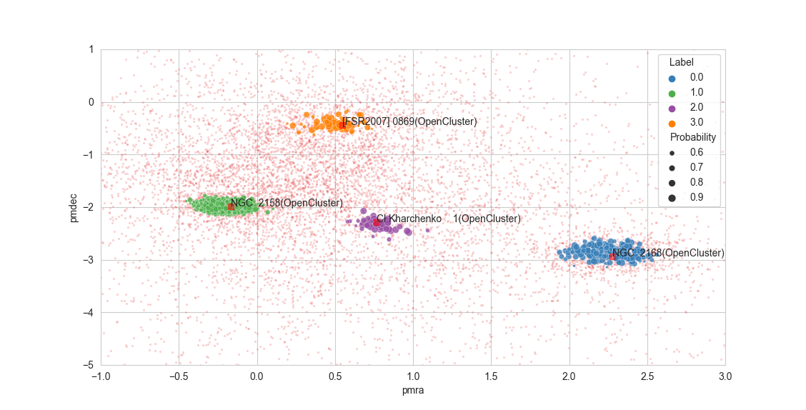

Quickstart
==========

CLI
^^^

From version 1.0.10 there's a suggested analysis pipeline in the form of a CLI tool to facilitate usage. To use it, create a script like the following, and run it:

.. literalinclude:: ../../examples/cli/cli.py

From there, you can download data from GAIA, load a file, run the analysis pipeline, plot and save results.

NOTES:

- For plotting to display correctly, you need to have the corresponding library installed, such as `PyQt6` in your environment.

- The CLI tool is still rudimentary, it will exit on some incorrect inputs. Follow the directions of the prompts carefully.

Main functionality example
^^^^^^^^^^^^^^^^^^^^^^^^^^

.. literalinclude:: ../../examples/pipeline/dep.py
    :language: python
    :linenos:

Documentation quick guide
^^^^^^^^^^^^^^^^^^^^^^^^^

* Building queries for GAIA catalogues and retrieving data: :class:`~scludam.fetcher.Query`

* Detection and membership estimation pipeline: :class:`~scludam.pipeline.DEP`

* Detection method: :class:`~scludam.detection.CountPeakDetector`

* Clusterability tests: :py:mod:`~scludam.stat_tests`

* Clustering method: :class:`~scludam.shdbscan.SHDBSCAN`

* Probability Estimation: :class:`~scludam.membership.DBME`

* Kernel Density Estimation with per-observation or per-dimension bandwidth, plugin or rule-of-thumb methods: :class:`~scludam.hkde.HKDE`

Documentation module guide
^^^^^^^^^^^^^^^^^^^^^^^^^^

* Query building, SIMBAD object searching and data related functionality: :py:mod:`~scludam.fetcher`

* Detection and membership estimation pipeline: :py:mod:`~scludam.pipeline`

* Detection: :py:mod:`~scludam.detection.CountPeakDetector`

* Clusterability tests: :py:mod:`~scludam.stat_tests`

* Clustering: :py:mod:`~scludam.shdbscan`

* Probability estimation: :py:mod:`~scludam.membership`

* Kernel Density Estimation:  :py:mod:`~scludam.hkde`

* Utils such as GAIA column names interpretation and one hot encoding:  :py:mod:`~scludam.utils`

* Custom ploting functions: :py:mod:`~scludam.plots`

* Utils for R communication:  :py:mod:`~scludam.rutils`

* Utils for masking data: :py:mod:`~scludam.masker`

* Useful distributions for data generation: :py:mod:`~scludam.synthetic`
